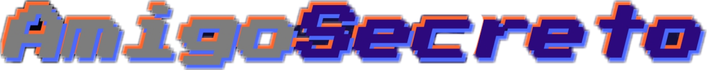
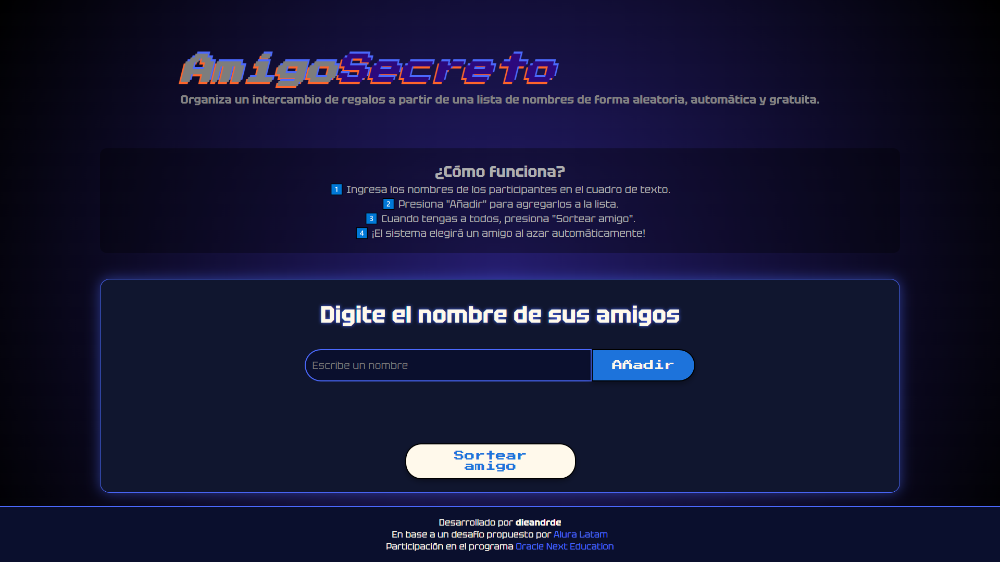

🔹 **¿Qué hace este proyecto?**  
Este proyecto permite organizar un **sorteo automático** de amigos secretos, donde los participantes se agregan a una lista y se elige un nombre al azar con un diseño visual **retro y minimalista**.  

---

## 🚀 **Características**  
✅ **Interfaz inspirada en el estilo retro y retro-glitch** 🎮  
✅ **Animación en el título y efecto neón** 💫  
✅ **Sorteo automático sin repeticiones** 🎲  
✅ **Diseño responsivo y adaptable** 📱  

---

## 🎨 **Capturas de Pantalla**


---

## 🛠️ **Tecnologías Utilizadas**
🔹 HTML5  
🔹 CSS3 (Animaciones y estilos neón)  
🔹 JavaScript (Lógica del sorteo)  
🔹 Git & GitHub  

---

## 🕹️ **Cómo Usarlo**
1️⃣ **Clona el repositorio**  
```bash
git clone https://github.com/dieandrde/challengeAmigoSecreto
```
<p>2️⃣ Abre index.html en tu navegador
<br>3️⃣ Agrega nombres a la lista y presiona "Sortear amigo"
<br>4️⃣ ¡Disfruta del sorteo con estilo retro!</p>

🔹 Hecho con ❤️ por dieandrde
